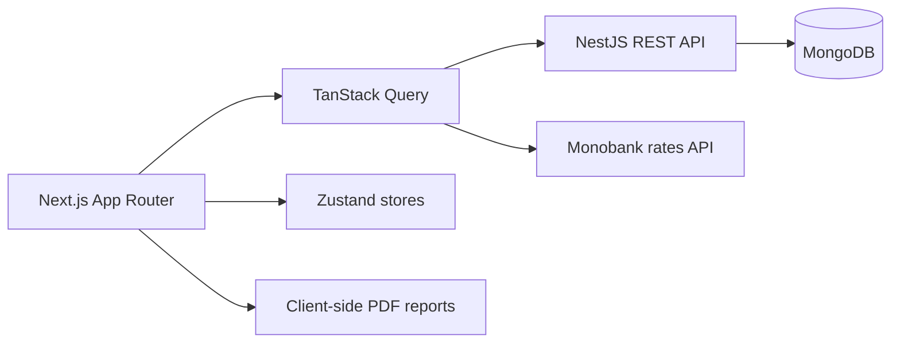

<div align="center">

# Finance - Personal Finance Dashboard

**Plan a monthly budget, understand spending, and build savings habits in one focused workspace.**

[](https://nextjs.org/)
[](https://react.dev/)
[](https://www.typescriptlang.org/)
[](https://tailwindcss.com/)

[Live application](https://finance-front-zeta.vercel.app/) · [Backend repository](https://github.com/bohdanhora/finance-backend)

</div>

## Overview

Finance is the frontend of a full-stack personal finance application. It combines day-to-day transaction tracking with monthly planning, visual analytics, savings goals, multi-currency balances, and configurable PDF reports.

The interface is responsive, theme-aware, and localized for English, Russian, and Ukrainian. Server data is synchronized through TanStack Query, while Zustand keeps the interactive finance workspace fast and predictable.

## Highlights

- **Monthly budget cockpit** - current balance, income, spending, remaining budget, next-month forecast, and configurable savings percentage.
- **Transaction management** - add, edit, remove, categorize, search, and filter income and expenses.
- **Essential payments** - maintain reusable required payments, mark actual paid amounts, and prepare the next month in advance.
- **Savings workspace** - create goals, calculate daily and monthly saving pace, and track deposits, withdrawals, and transfers between cash and card.
- **Spending analytics** - category breakdowns, daily dynamics, six-month history, trend views, projections, and comparisons with earlier months.
- **Multi-currency support** - work in UAH, USD, or EUR using current public Monobank exchange rates.
- **Custom PDF reports** - choose a period, included sections, and transaction filters before generating a localized report in the browser.
- **Complete authentication journey** - email verification, email/password login, Google OAuth, remember-me sessions, token refresh, logout, and password recovery.
- **Habit building** - account-based daily streaks, milestone celebrations, and a weekly activity view.
- **Polished UX** - dark and light themes, onboarding tour, built-in calculator, responsive navigation, validation, loading states, and toast feedback.

## Tech stack

| Area | Technology |
| --- | --- |
| Framework | Next.js 15 App Router, React 19, TypeScript |
| Styling | Tailwind CSS 4, Radix UI primitives, Lucide icons |
| Server state | TanStack Query, Axios |
| Client state | Zustand |
| Forms | React Hook Form, Zod |
| Charts | Chart.js, react-chartjs-2 |
| Reports | pdfmake |
| Localization | next-intl |
| Dates | date-fns, Day.js |
| Themes and feedback | next-themes, React Toastify |
| Testing | TypeScript compiler, Node.js test runner |

## Architecture



The application keeps responsibilities intentionally separated:

- route-level screens live in `app/`;
- reusable interface and feature components live in `components/`;
- HTTP mutations and queries live in `api/`;
- server-backed workspace state is hydrated into `store/`;
- calculations, statistics, auth helpers, and report generation live in `lib/`;
- translations live in `messages/`.

## Getting started

### Prerequisites

- Node.js 20 or newer
- npm
- A running instance of the [Finance backend](https://github.com/bohdanhora/finance-backend)

### Installation

```bash
git clone https://github.com/bohdanhora/finance-front.git
cd finance-front
npm ci
cp .env.example .env.local
npm run dev
```

On Windows PowerShell, use `Copy-Item .env.example .env.local` instead of `cp`.

For local development, update `.env.local` to point to the local API:

```dotenv
NEXT_PUBLIC_API_URL=http://localhost:8000
NEXT_PUBLIC_OAUTH_URL=http://localhost:8000/auth/google
NEXT_PUBLIC_MONO_API_URL=https://api.monobank.ua/bank/currency
```

Open [http://localhost:3000](http://localhost:3000).

## Environment variables

| Variable | Required | Description |
| --- | :---: | --- |
| `NEXT_PUBLIC_API_URL` | Yes | NestJS backend origin without a trailing slash. |
| `NEXT_PUBLIC_OAUTH_URL` | Yes | Backend endpoint that starts Google OAuth; normally `<API_URL>/auth/google`. |
| `NEXT_PUBLIC_MONO_API_URL` | Yes | Public Monobank exchange-rate endpoint. |

All variables are exposed to the browser by design. Do not place secrets in `NEXT_PUBLIC_*` values.

## Available scripts

| Command | Description |
| --- | --- |
| `npm run dev` | Start the Turbopack development server. |
| `npm run build` | Create an optimized production build. |
| `npm run start` | Serve the production build. |
| `npm run lint` | Run the Next.js ESLint checks. |
| `npm test` | Compile and run the finance calculation and report test suites. |
| `npm run prettier` | Format JavaScript, TypeScript, TSX, and JSON files. |

## Project structure

```text
finance-front/
├── app/          # App Router pages and global styles
├── api/          # API clients and TanStack Query hooks
├── components/   # UI primitives and domain components
├── config/       # Axios instances and interceptors
├── constants/    # Routes, categories, currencies, shared constants
├── hooks/        # Reusable client hooks
├── i18n/         # Locale resolution
├── lib/          # Calculations, reports, auth, dates, statistics
├── messages/     # en, ru, and ua translations
├── providers/    # Auth, data, query, theme, and toast providers
├── schemas/      # Zod form schemas
├── store/        # Zustand stores
├── tests/        # Unit tests for domain logic
└── types/        # Shared TypeScript contracts
```

## Authentication model

The API returns an access token, refresh token, and user ID. The frontend stores them in client-readable cookies, sends the access token as a Bearer token, and automatically rotates tokens after an unauthorized API response. Selecting **Remember me** persists the session for three days; otherwise, cookies remain session-scoped.

Google OAuth is initiated through the backend. After a successful callback, the backend redirects to `/login` with the issued credentials, and the frontend completes the session setup.

## Deployment

The frontend can be deployed to any platform that supports Next.js. Configure the three public environment variables in the hosting provider and ensure that:

1. the backend allows the deployed frontend origin through CORS;
2. `FRONTEND_URL` in the backend points to the deployed frontend;
3. the Google OAuth callback URL matches the backend deployment.

## Quality checks

The test suite covers savings balances and transfers, report aggregation, spending statistics and projections, and streak calculations.

```bash
npm test
npm run build
```

## Related project

The REST API, authentication, persistence, and budgeting domain logic are maintained in [finance-backend](https://github.com/bohdanhora/finance-backend).

## Author

Created by [Bohdan Hora](https://github.com/bohdanhora).
